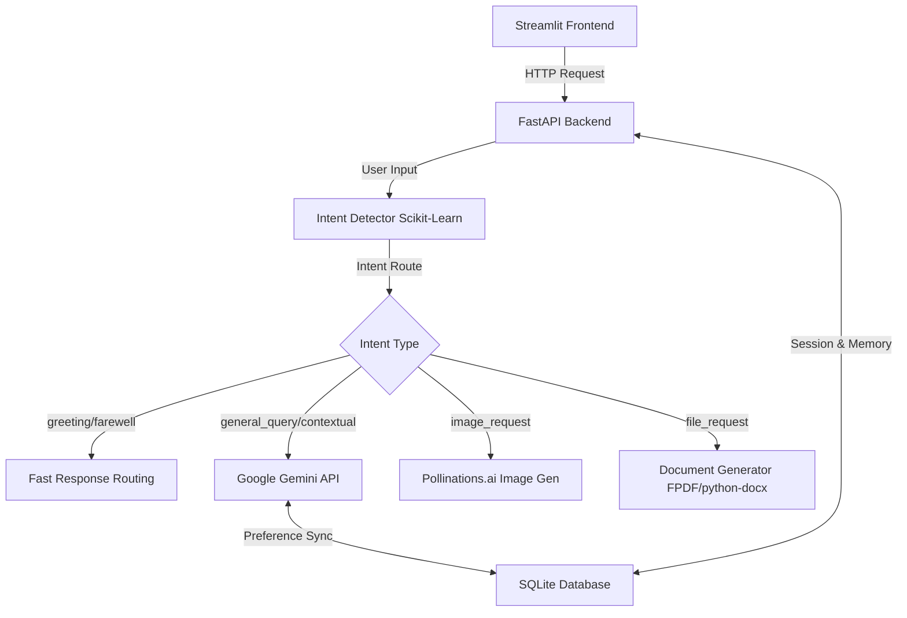

# CogniFlow AI - Complete Project Documentation

## 1. Executive Summary
CogniFlow AI is a personalized, multi-modal AI chatbot built to handle contextual conversations, dynamic intent detection, targeted text-to-image synthesis, and automated document generation (PDF/DOCX). By separating structural logic, persistent state storage, machine learning pipelines, and front-end interface development, the system exhibits modularity, stability, and high performance.

## 2. Project Architecture
The project follows a decoupled client-server architecture with specialized backend service components:

- **Frontend User Interface (Streamlit)**: Serves as the user-facing web portal for interactions, profile management, and session logs.
- **FastAPI Core Engine (Backend)**: Exposes endpoints for chat, database access, session handling, preference memory updates, and file downloads.
- **Persistent Storage (SQLite & SQLAlchemy)**: Manages relational storage of conversation histories, learned user preference arrays, and permanent credentials.
- **Intent Classifier**: An integrated Scikit-learn Classifier that maps inputs to appropriate pipelines prior to executing expensive LLM or media generation calls.
- **Multi-Modal Generation Integrations**:
  - **Google Gemini API**: General queries, conversational synthesis, preference-learning loops, and markdown document compilation.
  - **Pollinations.ai API**: Dynamic image creation strictly gated by classification state.
  - **FPDF & Python-Docx**: Document formatting utilities to dynamically transform text content into structured `.pdf` and `.docx` resources.

## 3. Component Details

### 3.1. Intent Detection (`app/intent_detector.py`)
To prevent unauthorized API access, token overflow, or logic hijacking, CogniFlow AI leverages a two-tier verification layer:
1. A localized, trained **TF-IDF + Support Vector Classifier (SVC)** / **Logistic Regression** pipeline trained on `data/intent_dataset.csv`.
2. The pipeline is compiled and persisted in `data/trained_model/intent_model.pkl` for fast, lightweight in-memory inference.
3. Fallback intent categorization via Google Gemini zero-shot learning ensures resilience if local confidence is below 75%.
4. A rich Intent Routing Engine UI displays the confidence scores and fallback details to the user.

Supported Intents:
- `greeting`: Welcomes the user with minimal latency.
- `farewell`: Ends the active conversational thread.
- `image_request`: Triggers the Pollinations.ai image pipeline.
- `file_request`: Creates structured document downloads.
- `general_query` / `contextual`: Conducts deeper analysis of preferences and responds with Gemini. `contextual` queries automatically pull in context from the user's previous session.

### 3.2. Personalization Engine (`app/chatbot.py`)
Equipped with dynamic preference extraction and fact learning:
- `learn_preferences()`: As the conversation progresses, this background engine extracts and updates a structured JSON dictionary of user habits, topics, and styles.
- `extract_facts()`: Extracts specific user facts like name, broad preferences, and last discussed topics into a persistent key-value store for cross-session memory.
- Contextual formatting automatically binds these parameters into system prompts to shape future conversational turns without manual user input.

### 3.3. File & Media Synthesis (`app/file_gen.py`, `app/image_gen.py`)
- **`app/file_gen.py`**: Formats structured text outputs into stylized, paginated PDF or DOCX files for academic or corporate use.
- **`app/image_gen.py`**: Formulates URL queries for Pollinations.ai, ensuring robust encoding and error handling.

### 3.4. Memory & SQLite Schema (`app/memory.py`)
A solid SQLite relational structure enables multi-session persistence:
- **`user_profiles` Table**: Tracks user identifiers and structured preference parameters.
- **`sessions` Table**: Triggers and persists individual threads belonging to specific user profiles.
- **`user_memory` Table**: A key-value store for tracking specific user facts (e.g., name, last topics).

## 4. Dataset & Model Specifications
- **`data/intent_dataset.csv`**: Contains pre-labeled sentence variations mapping to specific conversational goals.
- **`data/trained_model/intent_model.pkl`**: A serialized Scikit-learn Pipeline incorporating vectorizers and a production classifier.

## 5. Setup & Usage Instructions
Refer to [README.md](file:///c:/Users/dipak/Desktop/NEXtastra%20Technologies/chatbot/README.md) for full environmental execution details and port mappings.
